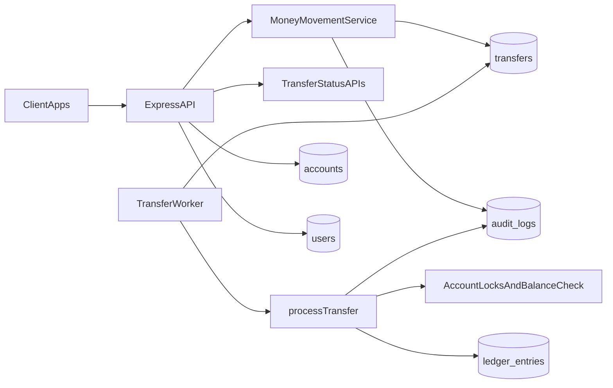
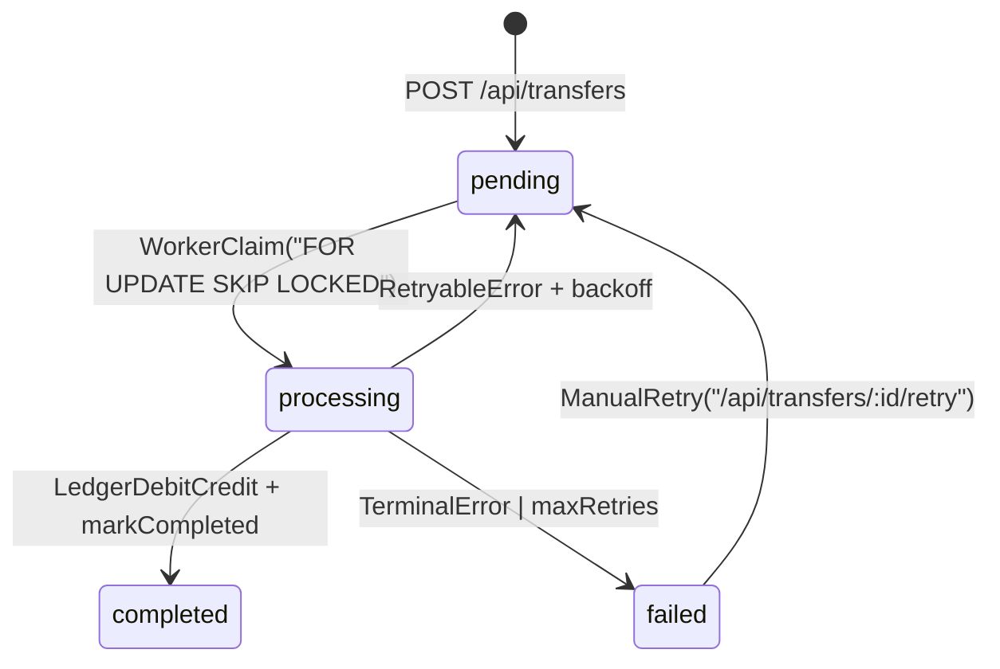

# WalletLedger Design Document

This document describes the current WalletLedger transfer architecture and a production-ready direction for reliability, scale, and compliance.

## 1) Architecture

### High-Level System Design

- **API tier:** Express serves transfer/account/auth endpoints with API key authentication and route-level rate limiting.
- **Command/Query split:** `POST /api/transfers` enqueues work quickly; status/dead-letter endpoints read transfer state.
- **Async processing tier:** `TransferWorker` polls and claims jobs from PostgreSQL, then applies movement logic.
- **Persistence tier:** PostgreSQL stores transfer queue state, immutable ledger entries, and audit events.

### Component Breakdown

- **Ingress layer**
  - Request logging, graceful shutdown guards, global and write-limiters.
  - API key auth protecting non-public paths.
- **Transfer orchestration**
  - `MoneyMovementService.enqueueTransfer()` performs validation, ownership checks, and idempotent enqueue.
  - `MoneyMovementService.processTransfer()` performs locked balance validation and atomic settlement.
- **Worker runtime**
  - Claim pending or stale-processing transfers.
  - Retry retryable errors with exponential backoff.
  - Send terminal failures to failed/dead-letter state.
- **Data/repository layer**
  - `TransactionRepository`: lifecycle state machine persistence.
  - `LedgerRepository`: debit/credit pair insertion and history retrieval.
  - `AuditLogRepository`: structured transfer event history.

## 2) Data Modelling

### Schema and Rationale

- **`users`**
  - Authentication identity, API key, profile metadata.
- **`accounts`**
  - Ownership container linked to user.
  - Does not store mutable balance column as source of truth.
- **`transfers`**
  - Queue + state machine entity (`pending`, `processing`, `completed`, `failed`).
  - Carries `idempotency_key`, retry counters, and timing metadata (`next_retry_at`, `processing_started_at`, `completed_at`, `failed_at`).
- **`ledger_entries`**
  - Immutable financial facts: one debit and one credit entry per completed transfer.
  - Account balance is derived by summing entries.
- **`audit_logs`**
  - Append-only event evidence for each lifecycle action and retry/failure reason.

### Why This Schema

- Ledger-first modeling provides deterministic replay and strong auditability.
- Transfer table doubles as durable queue and status source, minimizing external dependencies.
- JSONB metadata in audit logs gives flexible event enrichment without frequent schema migrations.

### Trade-offs

- **Derived balances**
  - Pro: No drift between cached balance and transaction history.
  - Con: More expensive reads; eventual mitigation via snapshots/materialized views.
- **Postgres queue**
  - Pro: Simpler operations and strong transactional guarantees with business data.
  - Con: Less throughput at very high scale vs dedicated broker systems.
- **Global idempotency uniqueness**
  - Pro: Simple and strict dedupe behavior.
  - Con: Wider key namespace than per-user/per-account scoping.

## 3) Event Flow

### Transfer Lifecycle

### Detailed Flow

1. **Client submission**
   - Client sends `POST /api/transfers` with `Idempotency-Key`.
   - API validates amount and account ownership.
2. **Idempotent enqueue**
   - If key exists, existing transfer is returned (`replayed: true`).
   - Else a new `pending` transfer is created and `TransferRequested` is audited.
3. **Worker claim**
   - Worker claims one eligible transfer atomically.
   - Eligible rows include:
     - `pending` with due retry time.
     - stale `processing` rows (recovery reclaim).
4. **Settlement**
   - Worker locks source/destination accounts.
   - Validates sufficient funds.
   - Inserts debit/credit ledger pair.
   - Marks transfer completed and writes `TransferCompleted`.
5. **Failure path**
   - Retryable errors requeue with exponential backoff.
   - Terminal or max-retry failures mark transfer `failed` with `last_error`.
   - Failed transfers are visible through dead-letter listing and manual retry endpoint.

## 4) Failure Handling

### Scenarios Handled

- **Transient infrastructure issues** (DB/network/service hiccups)
  - Auto-retry with backoff and retry counters.
- **Worker crash or process kill**
  - Stale `processing` rows are reclaimed by claim logic.
- **Business rule failure (insufficient funds)**
  - Mark failed immediately as terminal.
- **Duplicate requests**
  - Idempotency key dedupe prevents duplicate side effects.
- **Shutdown during traffic**
  - App enters shutdown mode, stops accepting new work, drains inflight, and stops worker gracefully.

### Recovery Strategy

- **Automatic recovery**
  - Backoff retries for retryable failures.
  - Stale processing reclaim for orphaned jobs.
- **Operator/user assisted recovery**
  - `GET /api/transfers/dead-letter` to inspect failed items.
  - `POST /api/transfers/:id/retry` to requeue selected failed transfer.
- **Forensic recovery**
  - Use `audit_logs` + `transfers` + `ledger_entries` to rebuild timeline and root cause.

## 5) Scaling Strategy

### Current Scaling Characteristics

- Claim pattern uses `FOR UPDATE SKIP LOCKED`, enabling safe multi-worker horizontal scaling.
- Partial indexes support queue scans by state and retry timings.

### Production Scale Plan

- **API tier**
  - Stateless API containers behind load balancer.
  - Horizontal autoscaling on CPU + request latency.
- **Worker tier**
  - Run multiple worker instances in separate process pool/deployment.
  - Tune polling and stuck thresholds using environment variables.
- **Database tier**
  - Read replicas for status/history reads.
  - Partition `transfers`, `ledger_entries`, and `audit_logs` by time to control index/table growth.
  - Maintain targeted partial indexes for pending/retry/processing selection.
- **Evolution path**
  - If queue pressure grows, migrate enqueue/claim to broker (Kafka/SQS/RabbitMQ) while preserving transfer state machine and audit contract in DB.

## 6) Security & Compliance

### Idempotency Strategy

- Transfer and funds-write endpoints require `Idempotency-Key`.
- Unique DB constraint on `transfers.idempotency_key` ensures hard dedupe.
- Replay behavior returns canonical existing transfer and avoids duplicate ledger writes.

### Audit Design

- Event taxonomy:
  - `TransferRequested`
  - `TransferProcessing`
  - `TransferCompleted`
  - `TransferFailed`
- Each audit event stores actor, transfer/account linkage, action, and structured metadata:
  - status
  - from/to account IDs
  - amount
  - retry count
  - failure reason
  - event timestamp
- Supports dispute handling, incident review, and compliance evidence generation.

### Data Protection Considerations

- **Access controls**
  - API key authentication gates non-public endpoints.
  - Ownership checks enforce least privilege on transfer/status/retry operations.
- **Abuse protection**
  - Global and strict write rate limits by API key/IP.
- **Secret handling**
  - Startup fails without required secrets (`JWT_SECRET`, `DATABASE_URL`).
- **Compliance hardening roadmap**
  - Encrypt sensitive data at rest and enforce TLS in transit.
  - Hash/rotate API keys (avoid long-term plaintext storage).
  - Define retention windows and purge/archive policy for audit/ledger exports.
  - Add data minimization controls for PII in audit metadata.

## 7) API Contract Baseline (for stakeholder sign-off)

This section resolves transfer payload/semantics expectations before external integrations.

- **Create transfer** `POST /api/transfers`
  - Request headers: `x-api-key`, `Idempotency-Key`
  - Request body: `fromAccountId`, `toAccountId`, `amount` (positive integer)
  - Response:
    - `201` new transfer queued
    - `200` idempotent replay
  - Body: `{ transfer, replayed }`
- **Transfer status** `GET /api/transfers/:id`
  - Response body: `{ id, status, failureReason }`
  - `failureReason` is null unless status is `FAILED`.
- **Dead-letter list** `GET /api/transfers/dead-letter`
  - Returns failed transfers owned by requester.
- **Manual retry** `POST /api/transfers/:id/retry`
  - Only for transfers currently in `FAILED`.
  - Requeues transfer to `PENDING`.

## 8) SLOs and Operational Alerts (initial production targets)

- **Availability**
  - `POST /api/transfers` success-rate SLO: `>= 99.9%` monthly (excluding client 4xx).
- **Latency**
  - Enqueue p95 target: `< 200ms`.
  - Status read p95 target: `< 150ms`.
- **Processing health**
  - p95 pending-to-completed time target: `< 30s` under normal load.
  - Dead-letter ratio alert: `failed / requested > 1%` for 10 minutes.
  - Retry saturation alert: sustained increase in `transferRetriedTotal` slope over baseline.
- **Backlog alerts**
  - Alert when oldest pending transfer age exceeds threshold (for example, 2 minutes).
  - Alert when stale processing reclaim count spikes.

## 9) Production Hardening Backlog

- Run worker horizontal scale/load tests (N workers, contention and fairness).
- Partition high-growth tables and validate query plans after partitioning.
- Move API key storage to hashed format with rotation tooling and revocation UX.
- Add retention/archival controls for audit logs and financial reporting exports.
- Consider outbox/events pattern for external notifications without dual-write risk.
